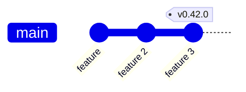
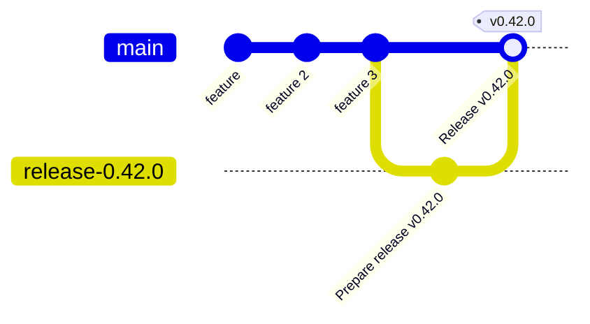
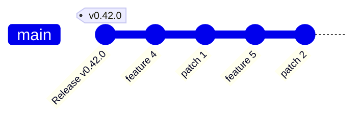

# Release Workflow

This document describes Cozystack’s release process.

## Introduction

Cozystack uses a staged release process to ensure stability and flexibility during development.

There are three types of releases:

- **Release Candidates (RC)** – Preview versions (e.g., `v0.42.0-rc.1`) used for final testing and validation.
- **Regular Releases** – Final versions (e.g., `v0.42.0`) that are feature-complete and thoroughly tested.
- **Patch Releases** – Bugfix-only updates (e.g., `v0.42.1`) made after a stable release, based on a dedicated release branch.

Each type plays a distinct role in delivering reliable and tested updates while allowing ongoing development to continue smoothly.

## Release Candidates

Release candidates are Cozystack versions that introduce new features and are published before a stable release.
Their purpose is to help validate stability before finalizing a new feature release.
They allow for final rounds of testing and bug fixes without freezing development.

Release candidates are given numbers `vX.Y.0-rc.N`, for example, `v0.42.0-rc.1`.
They are created directly in the `main` branch.
An RC is typically tagged when all major features for the upcoming release have been merged into main and the release enters its testing phase.
However, new features and changes can still be added before the regular release `vX.Y.0`.

Each RC contributes to a cumulative set of release notes that will be finalized when `vX.Y.0` is released.
After testing, if no critical issues remain, the regular release (`vX.Y.0`) is tagged from the last RC or a later commit in main.
This begins the regular release process, creates a dedicated `release-X.Y` branch, and opens the way for patch releases.

## Regular Releases

When making a regular release, we tag the latest RC or a subsequent minimal-change commit as `vX.Y.0`.
In this explanation, we'll use version `v0.42.0` as an example:



A regular release sequence starts in the following way:

1. Maintainer tags a commit in `main` with `v0.42.0` and pushes it to GitHub.
2. CI workflow triggers on tag push:
   1. Creates a draft page for release `v0.42.0`, if it wasn't created before.
   2. Takes code from tag `v0.42.0`, builds images, and pushes them to ghcr.io.
   3. Makes a new commit `Prepare release v0.42.0` with updated digests, pushes it to the new branch `release-0.42.0`, and opens a PR to `main`.
   4. Builds Cozystack release assets from the new commit `Prepare release v0.42.0` and uploads them to the release draft page.
3. Maintainer reviews PR, tests build artifacts, and edits changelogs on the release draft page.

   ```mermaid
   gitGraph
       commit id: "feature"
       commit id: "feature 2"
       commit id: "feature 3" tag: "v0.42.0"
       branch release-0.42.0
       checkout release-0.42.0
       commit id: "Prepare release v0.42.0"
       checkout main
       merge release-0.42.0 id: "Pull Request"
   ```

   When testing and editing are completed, the sequence goes on.

4. Maintainer merges the PR. GitHub removes the merged branch `release-0.42.0`.
5. CI workflow triggers on merge:
   1. Moves the tag `v0.42.0` to the newly created merge commit by force-pushing a tag to GitHub.
   2. Publishes the release page (`draft` → `latest`).
6. The maintainer can now announce the release to the community.



## Patch Releases

Making a patch release has a lot in common with a regular release, with a couple of differences:

* A release branch is used instead of `main`
* Patch commits are cherry-picked to the release branch.
* A pull request is opened against the release branch.


Let's assume that we've released `v0.42.0` and that development is ongoing.
We have introduced a couple of new features and some fixes to features that we have released 
in `v0.42.0`.

Once problems were found and fixed, a patch release is due.




1. The maintainer creates a release branch, `release-0.42,` and cherry-picks patch commits from `main` to `release-0.42`.
   These must be only patches to features that were present in version `v0.42.0`.

   Cherry-picking can be done as soon as each patch is merged into `main`,
   or directly before the release.

   ```mermaid
   gitGraph
       commit id: "Release v0.42.0" tag: "v0.42.0"
       branch release-0.42
       checkout main
       commit id: "feature 4"
       commit id: "patch 1"
       commit id: "feature 5"
       commit id: "patch 2"
       checkout release-0.42
       cherry-pick id: "patch 1"
       cherry-pick id: "patch 2"
   ```

   When all relevant patch commits are cherry-picked, the branch is ready for release.

2. The maintainer tags the `HEAD` commit of branch `release-0.42` as `v0.42.1` and then pushes it to GitHub.
3. CI workflow triggers on tag push:
    1. Creates a draft page for release `v0.42.1`, if it wasn't created before.
    2. Takes code from tag `v0.42.1`, builds images, and pushes them to ghcr.io.
    3. Makes a new commit `Prepare release v0.42.1` with updated digests, pushes it to the new branch `release-0.42.1`, and opens a PR to `release-0.42`.
    4. Builds Cozystack release assets from the new commit `Prepare release v0.42.1` and uploads them to the release draft page.
4. Maintainer reviews PR, tests build artifacts, and edits changelogs on the release draft page.
   
   ```mermaid
   gitGraph
       commit id: "Release v0.42.0" tag: "v0.42.0"
       branch release-0.42
       checkout main
       commit id: "feature 4"
       commit id: "patch 1"
       commit id: "feature 5"
       commit id: "patch 2"
       checkout release-0.42
       cherry-pick id: "patch 1"
       cherry-pick id: "patch 2" tag: "v0.42.1"
       branch release-0.42.1
       commit id: "Prepare release v0.42.1"
       checkout release-0.42
       merge release-0.42.1 id: "Pull request"
   ```

   Finally, when release is confirmed, the release sequence goes on.

5. Maintainer merges the PR. GitHub removes the merged branch `release-0.42.1`.
6. CI workflow triggers on merge:
   1. Moves the tag `v0.42.1` to the newly created merge commit by force-pushing a tag to GitHub.
   2. Publishes the release page (`draft` → `latest`).
7. The maintainer can now announce the release to the community.
